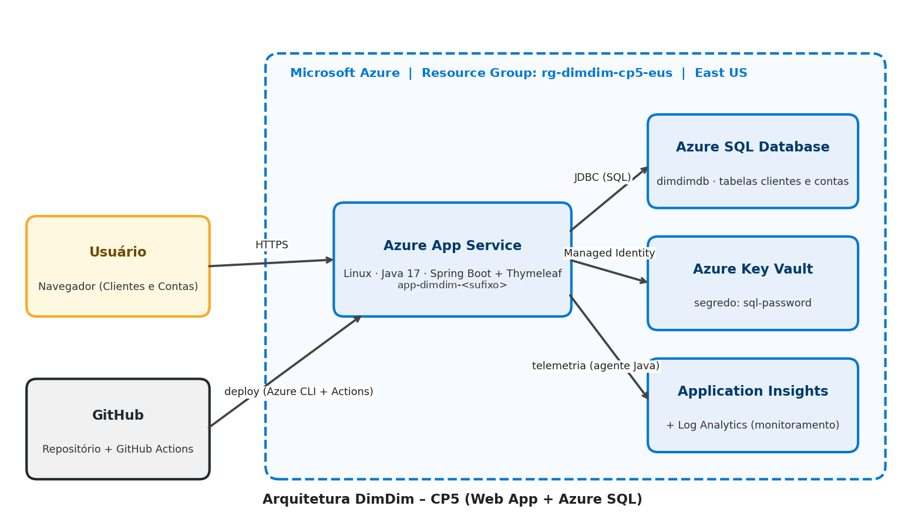

# DimDim – Clientes e Contas na Azure (CP5)

> **DevOps Tools & Cloud Computing – 2º Checkpoint / 2º Semestre – Aplicações e Banco em Nuvem**

| | |
|---|---|
| **Grupo** | `Gabi e Samara` |
| **Integrantes** | Samara Porto – RM559072 · Maria Gabriela Landim Severo – RM565146 |
| **Vídeo** | `PREENCHER_LINK_DO_VIDEO` |
| **Aplicação** | https://app-dimdim-13408.azurewebsites.net/clientes |

---

## 1. Descrição da solução

A consultoria do grupo ajuda a **DimDim** a testar em nuvem uma aplicação web antes de publicá-la oficialmente.

A solução é uma aplicação **web com front-end** (não é API) feita em **Java 17 + Spring Boot (MVC + Thymeleaf)** para gerenciar **Clientes** e suas **Contas**:

- **2 tabelas relacionadas** no **Azure SQL Database (PaaS)**: `clientes` (1) → (N) `contas` (FK `cliente_id`);
- **CRUD completo nas duas tabelas** pela interface web (cadastrar, listar, editar e excluir);
- Hospedagem no **Azure App Service** (Linux, Java 17), na região **East US**;
- **Azure Key Vault** guardando a senha do banco, lida pelo App Service via **Managed Identity** (Key Vault reference);
- Configurações de conexão em **variáveis de ambiente** (App Settings), nenhum segredo no código;
- **Application Insights** (agente Java) monitorando requisições, falhas e as **dependências SQL** (transações no banco);
- Deploy automatizado com **Azure CLI + `az webapp deploy`** (também disponível: **GitHub Actions**).

> **JSON das operações:** a entrega é uma aplicação MVC com front-end (Thymeleaf), **não é uma API REST**, por isso não há JSON de GET/POST/PUT/DELETE. As operações são feitas pelas telas `/clientes` e `/contas`.

## 2. Arquitetura



| Origem | Destino | Como |
|---|---|---|
| Usuário (navegador) | Azure App Service | HTTPS |
| App Service | Azure SQL Database | JDBC (Spring Data JPA) |
| App Service | Azure Key Vault | Managed Identity → secret `sql-password` |
| App Service | Application Insights | Agente Java (telemetria + dependências SQL) |
| Azure CLI / GitHub Actions | App Service | `az webapp deploy` / `azure/webapps-deploy` |

## 3. Estrutura do repositório

```
├── .github/workflows/deploy.yml   # (opcional) GitHub Actions, execução manual: build + deploy
├── docs/arquitetura.png           # desenho macro da arquitetura
├── scripts/
│   ├── 01-create-tables.sql       # DDL das tabelas (clientes, contas)
│   ├── 02-provision.sh            # Azure CLI: cria TODOS os recursos
│   ├── 03-github-secrets.sh       # Azure CLI: Service Principal do GitHub Actions (opcional)
│   ├── 04-deploy-manual.sh        # Azure CLI: build + deploy (az webapp deploy)
│   ├── 05-selects-video.sql       # SELECTs de evidência (antes/depois do CRUD)
│   └── 06-seed.sql                # dados iniciais (opcional)
├── src/main/java/...              # models, repositories, controllers
├── src/main/resources/templates/  # telas Thymeleaf (clientes, contas)
└── src/main/resources/application.properties  # só lê variáveis de ambiente
```

## 4. Modelo de dados (DDL em `scripts/01-create-tables.sql`)

| Tabela | Colunas |
|---|---|
| `dbo.clientes` | `id` (PK, identity), `nome`, `email` |
| `dbo.contas` | `id` (PK, identity), `numero`, `saldo`, `cliente_id` (FK → `clientes.id`, ON DELETE CASCADE) |

## 5. How to – implantação completa na nuvem

### Pré-requisitos
- Assinatura Azure ativa;
- Acesso a este repositório no GitHub;
- **Azure Cloud Shell (Bash)** no portal (já vem com `az`, `git`, `java` e `curl`). Pode ser o Azure CLI local também.

### Passo 1 – Clonar o repositório no Cloud Shell
```bash
git clone https://github.com/ssamaraps/dimdim-cp5.git
cd dimdim-cp5/scripts
chmod +x *.sh ../mvnw
```

### Passo 2 – Criar todos os recursos na Azure
```bash
./02-provision.sh
```
O script **pede o usuário e a senha** do banco no terminal (a senha não aparece na tela e não fica salva em arquivo) e cria:

1. Resource Group `rg-dimdim-cp5`;
2. Azure SQL Server + Database `dimdimdb` (tier Basic) e regras de firewall – região **Brazil South**;
3. Log Analytics + Application Insights `ai-dimdim` – Brazil South;
4. App Service Plan B1 Linux + Web App Java 17 – região **East US**;
5. Managed Identity no Web App;
6. Key Vault com o secret `sql-password` e permissão `get/list` para a identidade do app – Brazil South;
7. App Settings: `SPRING_DATASOURCE_URL`, `SPRING_DATASOURCE_USERNAME`, `SPRING_DATASOURCE_PASSWORD` (= `@Microsoft.KeyVault(...)`), `APPLICATIONINSIGHTS_CONNECTION_STRING` e ativação do agente Java.

No final, o script mostra o **nome do Web App** e a **URL**. Guarde esses valores.

> **Regiões:** os dados (SQL, Key Vault, App Insights) ficam em **Brazil South** e o App Service em **East US**, pois a assinatura Azure for Students restringe/limita a criação de recursos por região. As regiões podem ser alteradas pelas variáveis `LOC` e `APP_LOC` (ex.: `LOC=brazilsouth APP_LOC=brazilsouth ./02-provision.sh`).

### Passo 3 – Criar as tabelas
Portal Azure → SQL Database `dimdimdb` → **Query editor** → login com o usuário/senha do banco
(se aparecer erro de IP, clique em **Permitir IP ... no servidor** para liberar o seu IP no firewall) → cole e execute `scripts/01-create-tables.sql`.
Opcional: execute `scripts/06-seed.sql` para ter dados iniciais.

### Passo 4 – Deploy automatizado (Azure CLI + az webapp deploy)
Ainda no Cloud Shell, dentro da pasta `scripts`:
```bash
./04-deploy-manual.sh <nome-do-webapp>
```
O script compila a aplicação com Maven (`mvnw clean package`) e publica o `dimdim.jar` no App Service com `az webapp deploy`.
No final, mostra a URL da aplicação.

### Passo 5 – (Opcional) Deploy com GitHub Actions
O repositório também possui o workflow `.github/workflows/deploy.yml` (execução manual), que faz o build e o deploy no App Service. Para usá-lo:
```bash
./03-github-secrets.sh
```
Copie o JSON exibido (é sigiloso, não compartilhe) e no GitHub vá em **Settings → Secrets and variables → Actions → New repository secret**:

| Secret | Valor |
|---|---|
| `AZURE_CREDENTIALS` | JSON gerado pelo `03-github-secrets.sh` |
| `AZURE_WEBAPP_NAME` | nome do Web App exibido no Passo 2 (ex.: `app-dimdim-12345`) |

Depois, execute em *Actions → Deploy DimDim → Run workflow*.

### Passo 6 – Validar
1. Abra `https://<nome-do-webapp>.azurewebsites.net` (a primeira carga pode levar ~1 min).
2. Portal → App Service → **Variáveis de ambiente**: `SPRING_DATASOURCE_PASSWORD` deve aparecer com origem **Key vault Reference** e status verde.
3. Faça o CRUD nas telas **Clientes** e **Contas** e confira no Query Editor com `scripts/05-selects-video.sql`.

## 6. Testes (evidências de persistência)

Para cada operação, nas duas tabelas: **SELECT antes → operação na aplicação → SELECT depois**.

| Tabela | INSERT | UPDATE | DELETE |
|---|---|---|---|
| `clientes` | Novo cliente pela tela → aparece no SELECT | Editar nome → valor novo no SELECT | Excluir → linha some do SELECT |
| `contas` | Nova conta ligada a um cliente → aparece no SELECT | Editar saldo → valor novo no SELECT | Excluir → linha some do SELECT |

## 7. Segurança (sem segredos no código)

- `application.properties` contém **apenas** `${SPRING_DATASOURCE_URL}`, `${SPRING_DATASOURCE_USERNAME}` e `${SPRING_DATASOURCE_PASSWORD}`;
- Os valores ficam nas **variáveis de ambiente** do App Service;
- A **senha** do banco fica no **Azure Key Vault** e é lida via **Managed Identity** (Key Vault reference);
- Usuário/senha do banco são informados no terminal na hora do provisionamento, e não ficam nos scripts;
- As credenciais do GitHub Actions (opcional) ficam em **GitHub Secrets**.

## 8. Monitoramento – Application Insights

Agente Java ativado por App Settings (`APPLICATIONINSIGHTS_CONNECTION_STRING` + `ApplicationInsightsAgent_EXTENSION_VERSION=~3`).
Portal → `ai-dimdim`:
- **Live Metrics**: requisições em tempo real;
- **Application map**: App Service → Azure SQL;
- **Transaction search**: cada requisição do CRUD com a chamada SQL correspondente;
- **Failures**: falhas registradas;
- **Performance → Dependencies**: chamadas ao banco (`dimdimdb`).

Monitoramento do banco também no próprio **Azure SQL Database → Monitoramento → Métricas** (ex.: *Conexões bem-sucedidas* e *Percentual de DTU*).

## 9. Limpeza dos recursos
```bash
az group delete -n rg-dimdim-cp5 --yes --no-wait
```
